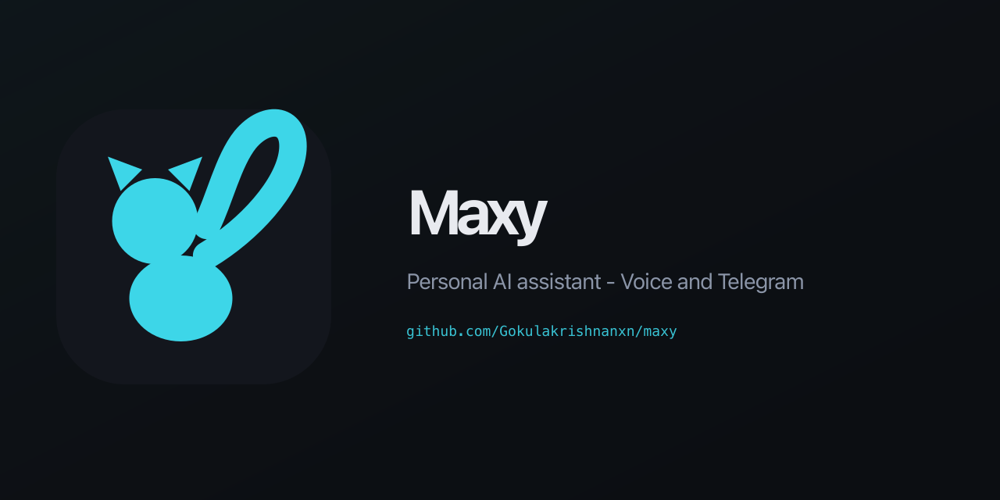

# Maxy — Personal AI Assistant

<p align="center">
  
</p>

Your personal AI that lives on your Mac. Runs as a voice assistant in the terminal or as a Telegram bot. Powered by Gemini + local Ollama models.

Developed and designed by [Gokulakrishnan](https://gokulakrishnan.dev).

**Documentation**

| Where | URL / how |
|-------|-----------|
| **npm** | [`maxyy` on npm](https://www.npmjs.com/package/maxyy) — `npm i -g maxyy` (package name is two **y**s, not `maxxy`). |
| **GitHub Pages** | [gokulakrishnanxn.github.io/maxy](https://gokulakrishnanxn.github.io/maxy/) — deploys from `docs/` on push to `main` (workflow in `.github/workflows/pages.yml`). In the repo: **Settings → Pages → Source: GitHub Actions**. |
| **Netlify** | Connect [the repo](https://github.com/Gokulakrishnanxn/maxy) in Netlify (**Add new site → Import from Git**). `netlify.toml` sets `publish = "docs"` and a no-op build. Each push to `main` redeploys. |
| **Local** | Open [`docs/index.html`](docs/index.html) or run `npx serve docs`. |

**GitHub link preview:** The image above is [`assets/github-social-preview.png`](assets/github-social-preview.png) (1280×640). Set **Settings → General → Social preview → Edit** and upload that file so link cards match. Favicon-sized icon: [`assets/logo.svg`](assets/logo.svg) · [`docs/favicon.svg`](docs/favicon.svg). Editable source: [`assets/github-social-preview.svg`](assets/github-social-preview.svg).

---

## Install

**npm package:** [npmjs.com/package/maxyy](https://www.npmjs.com/package/maxyy) — the name is **`maxyy`** (two **y**s), not `maxxy`.

**Option A — from npm (recommended):**

```bash
npm i -g maxyy
```

After install, use the **`maxyy`** command (e.g. `maxyy setup`, `maxyy voice`). A **`maxy`** shim is also registered for backward compatibility.

**Option B — from GitHub:**

```bash
npm i -g git+https://github.com/Gokulakrishnanxn/maxy.git
```

**Option C — clone and link:**

```bash
git clone https://github.com/Gokulakrishnanxn/maxy.git
cd maxy
npm link
```

**Requirements:** Node.js 16+, Python 3.8+, macOS (Linux supported, Windows untested). For Option B, the repo must be **public**, or use a URL with a [personal access token](https://docs.github.com/en/authentication/keeping-your-account-and-data-secure/creating-a-personal-access-token) for private repos.

---

## Quick Start

```bash
# 1. First-time setup (API keys, voice, model)
maxyy setup

# 2. Pick your interface
maxyy voice          # voice assistant in terminal
maxyy telegram       # Telegram bot
```

---

## Commands

```
maxyy setup              First-time config wizard
maxyy voice              Voice assistant — push-to-talk (press Enter to speak)
maxyy voice --wake       Always-on mode — say "Hey Maxy" to activate
maxyy voice --text       Keyboard-only mode (no microphone)
maxyy telegram           Start the Telegram bot
maxyy --version          Print version
maxyy --help             Show help
```

---

## Voice Assistant

```bash
maxyy voice
```

| Mode | How to use |
|------|-----------|
| **Push-to-talk** (default) | Press Enter → speak → pause to stop |
| **Always-on** `--wake` | Say "Hey Maxy" → speak your command |
| **Text only** `--text` | Just type, no mic needed |

**Say "bye" or "exit" to quit.**

### Voice options

```bash
maxyy voice --voice Daniel       # change voice (any macOS say voice)
maxyy voice --model small        # Whisper model: tiny / base / small / medium
```

List available voices:
```bash
say -v '?'
```

---

## Telegram Bot

```bash
maxyy telegram
```

### Bot commands

| Command | What it does |
|---------|-------------|
| `/start` | Show all commands |
| `/brief` | Morning summary — date, weather, emails, reminders, tasks |
| `/inbox` | Check unread Gmail |
| `/weather [city]` | Current weather (default: Chennai) |
| `/search <query>` | Live web search |
| `/remind 30m take a break` | Set a reminder |
| `/reminders` | List upcoming reminders |
| `/todo add\|list\|done\|delete` | Manage tasks |
| `/note <text>` | Save a note |
| `/model` | Show or switch AI model |

Or just **talk naturally** — Maxy understands context from your conversation history.

---

## AI Models

Maxy supports two backends. Switch anytime.

### Gemini (default)
Cloud-based. Fast, multilingual, strong reasoning.
- Model: `gemini-2.5-flash`
- Requires: `GEMINI_API_KEY`

### Ollama (local)
Runs entirely on your machine. Private, no API key needed.
- Models: any model you have pulled locally
- Requires: [Ollama](https://ollama.com) running (`ollama serve`)

### Switch models

```bash
# In Telegram
/model                  # show current model
/model gemini           # switch to Gemini
/model llama3.1:8b      # switch to Ollama
/model list             # list local Ollama models
```

### Auto-fallback

When your **Gemini quota is exceeded**, Maxy automatically switches to your best available Ollama model and notifies you. When Ollama is down, it falls back to Gemini silently.

---

## Language Support

Maxy auto-detects the language you write or speak in and replies in the same language.

| Language | Detection | TTS Voice |
|----------|-----------|-----------|
| English | Default | Samantha (en_US) |
| Thanglish | Tamil words in Roman script | Samantha |
| Tamil | Tamil Unicode script | Vani (ta_IN) |
| Hindi | Devanagari script | Lekha (hi_IN) |

**Thanglish example:**
> You: *hey maxyy epdi iruka?*
> Maxy: *na nalla irukan gokulakrishnan.* 😄

---

## Features

### Gmail
- Read unread emails — `/inbox`
- Ask naturally: *"check my email"*, *"any unread mails?"*
- Draft and send with confirmation — Maxy always asks before sending

First-time Gmail setup:
1. Go to [Google Cloud Console](https://console.cloud.google.com)
2. Enable the Gmail API
3. Download `credentials.json` → place at `~/maxy/credentials.json`
4. Run Maxy — it will open a browser to authorize

### Weather
No API key needed. Powered by [wttr.in](https://wttr.in).
```
/weather Chennai
/weather London
```
Or say: *"what's the weather like today?"*

### Web Search
No API key needed. Powered by DuckDuckGo.
```
/search latest iPhone news
```
Or say: *"search for best Python libraries 2025"*

### Reminders

```
/remind 30m take a break
/remind 2h call mom
/remind 1d submit invoice
/reminders
```

Supported durations: `s` (seconds), `m` (minutes), `h` (hours), `d` (days)

### Todo List

```
/todo add finish the report
/todo list
/todo done 3
/todo delete 3
```

### Notes & Memory

```
/note Priya's birthday is March 12
/note I prefer dark mode
```

Maxy also auto-saves facts when you say things like:
- *"my name is..."*
- *"I work at..."*
- *"remember that..."*

---

## Configuration

All config lives in `~/maxy/.env`. Edit it directly or re-run `maxyy setup`.

```env
GEMINI_API_KEY=your_key_here
TELEGRAM_BOT_TOKEN=your_token_here
MAXY_VOICE=Samantha
MAXY_BACKEND=gemini
MAXY_OLLAMA_MODEL=llama3.1:8b
VOICE_USER_ID=voice_local
```

Override the data directory:
```bash
MAXY_HOME=/custom/path maxyy voice
```

---

## Data & Privacy

| What | Where |
|------|-------|
| Conversation history | `~/maxy/maxy.db` (SQLite) |
| Notes & tasks | `~/maxy/maxy.db` |
| Gmail credentials | `~/maxy/credentials.json` |
| Config / API keys | `~/maxy/.env` |

Nothing leaves your machine except API calls to Gemini (if using Gemini backend). Use Ollama for fully local/private operation.

---

## Manual Setup (without npm)

```bash
git clone https://github.com/Gokulakrishnanxn/maxy.git
cd maxy
python3 -m venv venv
source venv/bin/activate
pip install -r requirements.txt
cp .env.example .env   # fill in your keys
python voice.py        # voice mode
python main.py         # telegram bot
```

---

## Tech Stack

| Layer | Technology |
|-------|-----------|
| AI (cloud) | Google Gemini 2.5 Flash |
| AI (local) | Ollama (llama3.1, neural-chat, any model) |
| Speech-to-Text | OpenAI Whisper (local, no API key) |
| Text-to-Speech | macOS `say` command (built-in) |
| Telegram | python-telegram-bot |
| Email | Gmail API |
| Web Search | DuckDuckGo (no API key) |
| Weather | wttr.in (no API key) |
| Scheduler | APScheduler |
| Storage | SQLite |
| CLI wrapper | Node.js |

---

## License

This project is licensed under the [MIT License](LICENSE).

Copyright (c) 2026 Gokulakrishnan. See [LICENSE](LICENSE) for the full text.
